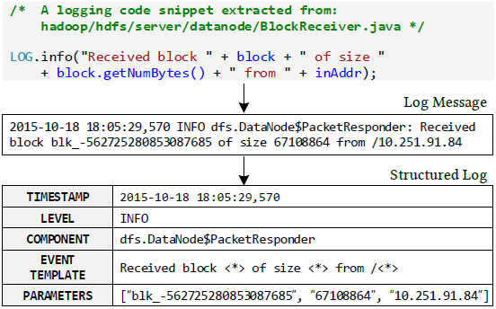
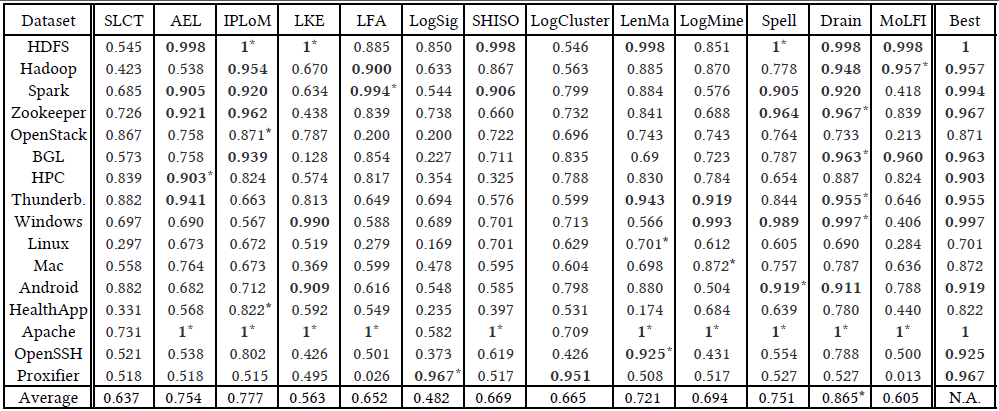

 

# Logparser  

Logparser provides a toolkit and benchmarks for automated log parsing, which is a crucial step towards structured log analytics. By applying logparser, users can automatically learn event templates from unstructured logs and convert raw log messages into a sequence of structured events. In the literature, the process of log parsing is sometimes refered to as message template extraction, log key extraction, or log message clustering. 

 An illustrative example of log parsing

:point_right: Read the docs: https://logparser.readthedocs.io

:telescope: If you use any of our tools or benchmarks in your research for publication, please kindly cite the following papers.
+ [**ICSE'19**] Jieming Zhu, Shilin He, Jinyang Liu, Pinjia He, Qi Xie, Zibin Zheng, Michael R. Lyu. [Tools and Benchmarks for Automated Log Parsing](https://arxiv.org/pdf/1811.03509.pdf). *International Conference on Software Engineering (ICSE)*, 2019.
+ [**DSN'16**] Pinjia He, Jieming Zhu, Shilin He, Jian Li, Michael R. Lyu. [An Evaluation Study on Log Parsing and Its Use in Log Mining](https://jiemingzhu.github.io/pub/pjhe_dsn2016.pdf). *IEEE/IFIP International Conference on Dependable Systems and Networks (DSN)*, 2016.

### Log parsers currently available:

| Tools | References |
| :--- | :--- |
| SLCT | [**IPOM'03**] [A Data Clustering Algorithm for Mining Patterns from Event Logs](http://www.quretec.com/u/vilo/edu/2003-04/DM_seminar_2003_II/ver1/P12/slct-ipom03-web.pdf), by Risto Vaarandi. |
| AEL | [**QSIC'08**] [Abstracting Execution Logs to Execution Events for Enterprise Applications](https://www.researchgate.net/publication/4366728_Abstracting_Execution_Logs_to_Execution_Events_for_Enterprise_Applications_Short_Paper), by Zhen Ming Jiang, Ahmed E. Hassan, Parminder Flora, Gilbert Hamann.   [**JSME'08**] [An Automated Approach for Abstracting Execution Logs to Execution Events](http://www.cse.yorku.ca/~zmjiang/publications/jsme2008.pdf), by Zhen Ming Jiang, Ahmed E. Hassan, Gilbert Hamann, Parminder Flora.  |
| IPLoM | [**KDD'09**] [Clustering Event Logs Using Iterative Partitioning](https://web.cs.dal.ca/~makanju/publications/paper/kdd09.pdf), by Adetokunbo Makanju, A. Nur Zincir-Heywood, Evangelos E. Milios.   [**TKDE'12**] [A Lightweight Algorithm for Message Type Extraction in System Application Logs](http://ieeexplore.ieee.org/abstract/document/5936060/), by Adetokunbo Makanju, A. Nur Zincir-Heywood, Evangelos E. Milios.  |
| LKE | [**ICDM'09**] [Execution Anomaly Detection in Distributed Systems through Unstructured Log Analysis](https://www.microsoft.com/en-us/research/wp-content/uploads/2016/02/DM790-CR.pdf), by Qiang Fu, Jian-Guang Lou, Yi Wang, Jiang Li. [**Microsoft**]  |
| LFA | [**MSR'10**] [Abstracting Log Lines to Log Event Types for Mining Software System Logs](http://www.se.rit.edu/~mei/publications/pdfs/Abstracting-Log-Lines-to-Log-Event-Types-for-Mining-Software-System-Logs.pdf), by Meiyappan Nagappan, Mladen A. Vouk. |
| LogSig | [**CIKM'11**] [LogSig: Generating System Events from Raw Textual Logs](https://users.cs.fiu.edu/~taoli/pub/liang-cikm2011.pdf), by Liang Tang, Tao Li, Chang-Shing Perng.  |
| SHISO | [**SCC'13**] [Incremental Mining of System Log Format](http://ieeexplore.ieee.org/document/6649746/), by Masayoshi Mizutani. |
| LogCluster | [**CNSM'15**] [LogCluster - A Data Clustering and Pattern Mining Algorithm for Event Logs](http://dl.ifip.org/db/conf/cnsm/cnsm2015/1570161213.pdf), by Risto Vaarandi, Mauno Pihelgas.  |
| LenMa | [**CNSM'15**] [Length Matters: Clustering System Log Messages using Length of Words](https://arxiv.org/pdf/1611.03213.pdf), by Keiichi Shima. |
| LogMine | [**CIKM'16**] [LogMine: Fast Pattern Recognition for Log Analytics](http://www.cs.unm.edu/~mueen/Papers/LogMine.pdf), by Hossein Hamooni, Biplob Debnath, Jianwu Xu, Hui Zhang, Geoff Jiang, Adbullah Mueen. [**NEC**] |
| Spell | [**ICDM'16**] [Spell: Streaming Parsing of System Event Logs](https://www.cs.utah.edu/~lifeifei/papers/spell.pdf), by Min Du, Feifei Li.  |
| Drain | [**ICWS'17**] [Drain: An Online Log Parsing Approach with Fixed Depth Tree](https://jiemingzhu.github.io/pub/pjhe_icws2017.pdf), by Pinjia He, Jieming Zhu, Zibin Zheng, and Michael R. Lyu.   [IBM-Drain3](https://github.com/IBM/Drain3): IBM's upgrade version of Drain in Python 3.6 with additional features. |
| MoLFI | [**ICPC'18**] [A Search-based Approach for Accurate Identification of Log Message Formats](http://publications.uni.lu/bitstream/10993/35286/1/ICPC-2018.pdf), by Salma Messaoudi, Annibale Panichella, Domenico Bianculli, Lionel Briand, Raimondas Sasnauskas.  |

### Get started

Code organization:

+ [benchmark](./benchmark): the benchmark scripts to reproduce the evaluation results of log parsing 
+ [demo](./demo): the demo files to show how to run logparser on HDFS logs.
+ [logparser](./logparser): the logparser package
+ [logs](./logs): Some log samples and manually parsed structured logs with their templates (ground truth).

Please follow the [installation steps](https://logparser.readthedocs.io/en/latest/installation/dependency.html) and [demo](https://logparser.readthedocs.io/en/latest/demo.html) in the docs to get started. 

### Benchmarking results
All the log parsers have been evaluated across 16 different logs available in [loghub](https://github.com/logpai/loghub). We report parsing accuracy as the percentage of accurately parsed log messages. To reproduce the experimental results, please run the [benchmark](./benchmark) scripts.

 
:point_down: Check the detailed bechmarking result table (click to expand)

 
 

 
 In the table, accuracy values above 0.9 are marked in bold, and the best accuracy results achieved are marked with \*. Some of the accuracy values may be lower than what have been reported by previous studies (e.g., Drain, LogMine). The reasons are two-fold: 1) We use a more rigorous accuracy metric which rejects events that are only partially matched. 2)  For fairness of comparison, we apply only a few preprocessing regular expressions (e.g., IP or number replacement) to each log parser. Adding more preprocessing rules can boost parsing accuracy, but requires more manual efforts as well.

### Publications about logparser
+ [**ICSE'19**] Jieming Zhu, Shilin He, Jinyang Liu, Pinjia He, Qi Xie, Zibin Zheng, Michael R. Lyu. [Tools and Benchmarks for Automated Log Parsing](https://arxiv.org/pdf/1811.03509.pdf). International Conference on Software Engineering (ICSE), 2019.
+ [**TDSC'18**] Pinjia He, Jieming Zhu, Shilin He, Jian Li, Michael R. Lyu. [Towards Automated Log Parsing for Large-Scale Log Data Analysis](https://jiemingzhu.github.io/pub/pjhe_tdsc2017.pdf). IEEE Transactions on Dependable and Secure Computing (TDSC), 2018.
+ [**ICWS'17**] Pinjia He, Jieming Zhu, Zibin Zheng, Michael R. Lyu. [Drain: An Online Log Parsing Approach with Fixed Depth Tree](https://jiemingzhu.github.io/pub/pjhe_icws2017.pdf). IEEE International Conference on Web Services (ICWS), 2017.
+ [**DSN'16**] Pinjia He, Jieming Zhu, Shilin He, Jian Li, Michael R. Lyu. [An Evaluation Study on Log Parsing and Its Use in Log Mining](https://jiemingzhu.github.io/pub/pjhe_dsn2016.pdf). IEEE/IFIP International Conference on Dependable Systems and Networks (DSN), 2016.

### Acknowledgement
Logparser is implemented based on a number of existing open-source projects:
+ [SLCT](http://ristov.github.io/slct/) (C++)
+ [LogCluster](https://github.com/ristov/logcluster) (perl)
+ [LenMa](https://github.com/keiichishima/templateminer) (python 2.7)
+ [MoLFI](https://github.com/SalmaMessaoudi/MoLFI) (python 3.6)

### Feedback
For any questions or feedback, please post to [the issue page](https://github.com/logpai/logparser/issues). 

