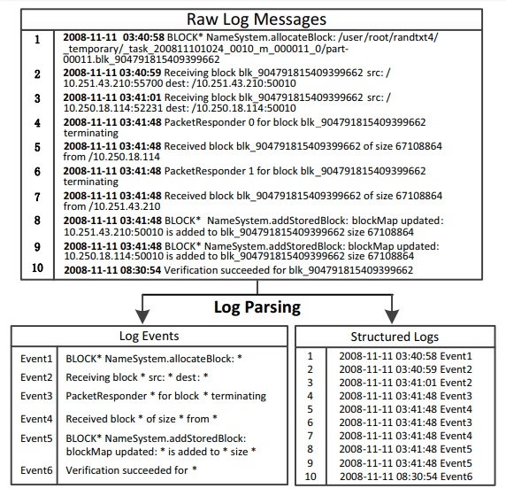

Overview
========
Logparser aims to provide a set of open-source tools that are ready for use in production. By applying logparser, users can automatically learn event templates from unstructured logs and convert raw log messages into a sequence of structured events. The following figure illustrates an overview of log parsing. 

